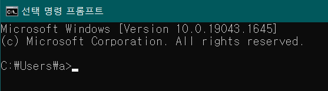

## 파이썬
: interpreter 방식의 프로그래밍 언어  
Executable pseudocode (실행 가능한 의사코드)
- C언어 보다 10~350배 느리다
  

### Integrated Development and Learning Environment
|텍스트 에디터|+|코드 실행기 (인터프리터)|=|IDE (통합 개발 환경)
|-|-|-|-|-|
|VS Code||||Jupyter Notebook, PyCharm
  

### 명령 프롬프트창

인터렉티브 셸  
$\gt\gt$ 프롬프트
  

# 중요 함수
## print(), f-string, join()
<pre>
<code>
    print(".", end="")
    print(f"저는 {s}를 좋아합니다. 하루 {n}잔 마셔요.")

    print('\n'.join(["이름 : {}", "몸무게 : {}"]).format(name, weight))
</code>
</pre>

# 자료형
## 문자열 찾기 : find(), rfind() : 1개만 찾고 빠짐
find() : 왼쪽부터  
rfind() : 오른쪽부터 (그러나 문자열 읽는 순서는 왼->오)
<pre>
<code>
    output_a = "안녕하세요".find("안녕")
    print(output_a)
    >>> index 리턴
</code>
</pre>

## in 연산자
<pre>
<code>
    output_a = "안녕" in "안녕하세요"
    print(output_a)
    >>> boolean 리턴
</code>
</pre>

## 문자열 자르기 : split()
<pre>
<code>
    output_a = "10 20 30".split()
    print(output_a)
    >>> list 리턴
</code>
</pre>

# 조건문
## 불 자료형, if 조건문

||단항 연산자|이항 연산자
|-|-|-|
피연산자|1개|2개
e.g.|not|+, -, *, ...

<pre>
<code>
    print("다음의 결과를 맞춰보자")
    print(True and True)
    print(True and False)
    print(False and True)
    print(False and False)
    print(True or True)
    print(True or False)
    print(False or True)
    print(False or False)
    print("TFFFTTTF")
</code>
</pre>

> Soft tab (소프트탭) : Tab키 = 자동 띄어쓰기 4번(indent)

- Q) 짝수 홀수 구분
    - last character가 0, 2, 4, 6, 8 인지
    - in 연산자로 "02468"
    - % 연산자 ==0
  
<pre>
<code>
    if 0:
        print("None, 0, 0.0, 빈 컨테이너는 False 반환")
    if "":
        print("빈 컨테이너 : 빈 문자열, 빈 바이트열, 빈 리스트, 빈 튜플, 빈 딕셔너리")
</code>
</pre>

## pass 키워드
: 미구현 부분

## raise NotImplementedError
: pass 로 입력해 놨어도 잊어버릴 수 있으므로

<pre>
<code>
    number = int(input("정수 입력"))
    if number > 0:
        raise NotImplementedError("if number에서 임플멘티드 에러 발생")
    # 
</code>
</pre>

# 리스트
<pre>
<code>
    list_a = [273, 32, "문자열", True]
    list_b = [4, 5, 6]
    
    # 1. 리스트의 요소 변경
    list_a[0] = "변경"

    # 2. 리스트 연산자
    list_a + list_b # 순서대로 합침
    list_a * 3 # 횟수만큼 반복

    # 3. append, insert
    list_a.append(5) # 리스트의 마지막에 요소 추가
    list_a.insert(0, 10) # 원하는 index에 요소 추가. 원래 요소들은 하나씩 밀림

    # 4. extend
    list_a.extend([4, 5, 6]) # 여러 요소 한번에 추가
    # list_a + list_b 연산자와의 차이 : .extend()는 <u>파괴적 처리</u>임

    # 5. del, pop
    del list_a[3]
    list_a.pop(2) # 인덱스 입력 안하면 마지막 요소 제거
    # del 과 pop 의 차이 : pop은 삭제하면서 삭제하는 요소를 리턴함

    # 6. remove
    list_a.remove(요소/값) # 리스트에 여러 개의 같은 값이 있다면, 가장 먼저 발견되는 값 하나만

    # 7. clear
    list_a.clear() # 리스트 모두 제거

    # 8. in / not in
    23 in list_a # Boolean 리턴
</code>
</pre>

## 리스트 평탄화
요소 꺼낸 후 타입 체크한 후, 리스트면 다시 재귀(요소 꺼내고 ..)

# 딕셔너리
<pre>
<code>
   # 1. 새로운 값 대치
   dict_a["a"] = '건조 파인애플' # 'a' 라는 키가 이미 존재하고 있다면 기존의 값 대치
   # 키가 없다면 새로 추가되는 a 키

   # 2. 삭제
   del dict_a["a"] # 키가 삭제됨 (값 전체 삭제)

   # 3. in
   "a" in dict_a # Boolean 리턴

   # 4. get()
   dict_a.get("a") # 값 리턴
   # 키가 없다면, None 리턴 (에러 안남)

</code>
</pre>

# 기타 관련 함수
## range, for, while
<pre>
<code>
    # 1. range
    # range(0, n / 2) 하면 TypeError 발생 (반드시 정수가 들어가야 하므로)
    # 주로 n // 2

    # 2. 역반복문
    range(50, 10, -3)
    reversed(range(10, 50, 3))

    # 3. while
    while element in list_a:
        list_a.remove(element)
    # 리스트 a에서 element 가 없어질때까지 반복함

    while time.time() < target_tick:
        number += 1

    # 4. break, continue

</code>
</pre>

## 리스트 관련 함수 : reversed(), enumerate()
<pre>
<code>
    list_a.min()
    list_a.max()
    list_a.sum()
    
# 첫번째 반복문만 실행됨 : reversed() 가 <u>제너레이터</u>이기 때문
    temp = reversed([1, 2, 3, 4, 5, 6])
    for i in temp:
        print("{}".format(i))
        
    for i in temp:
        print("{}".format(i))

    for idx, value in enumerate(example_list):
        print("{} 와 {}".format(idx, value))
</code>
</pre>

## 리스트 내포 : [ i * i for i in range(20)]

## 딕셔너리 관련 함수 : items()

<pre>
<code>
    for key, value in dict_a.items():
        print("키, 값이 같이 출력됨")
</code>
</pre>

## 문자열 함수 : 구문 내부 여러줄, join()
<pre>
<code>
    print("""입력한
    문자열은
    네모입니다
    """)
    # indent 이 2~3번째 줄 들어가 있음
    
    print(
        "입력한"
    "문자열은"
    "네모입니다"
    )
    # 한 줄로 출력된다

    print(
        "입력한",
    "문자열은",
    "네모입니다"
    )
    # 쉼표로 나뉘어 있으면 <u>튜플</u> 이 된다

    # 문자열.join(문자열로 구성된 리스트)
    print("::".join(["1", "2", "3"]))
    # :: 로 이어짐
</code>
</pre>

# 함수
## 매개변수
<pre>
<code>
    def 함수 이름(매개변수, 매개변수, ...):
        문장

    def 함수 이름(매개변수, 매개변수, ..., *가변 매개변수):
        문장
    # 가변 매개변수 :
    # 항상 매개변수 뒤에 옴
    # 1개만 사용 가능

    def print_n_times(n, *values):
        문장

    print_n_times(3, "안녕하세요", "즐거운", "프로그래밍")
    # 대신 나뉘어져 있으므로 <u>튜플</u>로 나온다 (" ", " ", " ")

    1. def print_n_times(n=2, value):
    2. def print_n_times(value, n=2):
    # 1번의 경우
    # SyntaxError: non-default argument follows default argument
    # print_n_times("안녕하세요") 의 경우, n에 할당될지, value에 할당될지 판별x기 때문
    # 그리고 n의 type이 int 로 되어있음 (그리고 range()에 들어간다면)

    print(value, ..., sep=' ', end= '\n', file= sys.stdout, flush=False)
    # 키워드 매개변수 = '값' 이런 식으로 이름까지 다 써주는

    def test(a, b=10, c=100):
        print(a + b + c)
    # 1. test(10, 20, 30) => 60
    # 2. test(a=10, b=100, c==200) => 310
    # 3. test(c=10, a=100, b=200) => 310
    # 4. test(10, c=200) => 210
    # 키워드 매개변수 : 필요한 매개변수에만 값 지정
</code>
</pre>

## 리턴
<pre>
<code>
    def return_test():
        return
    # None 리턴
</code>
</pre>

## 재귀함수 (recursion)
<pre>
<code>
    # 팩토리얼 함수 
    def factorial(n):
    f = 1
    for i in range(1, n + 1):
        f *= i
    return f
    factorial(6)

    # 팩토리얼 함수 (재귀함수)
    def factorial(n):
        if n == 0:
            return 1
        else:
            return n * factorial(n-1)
    factorial(6)

    # time.time() 으로 end - start 측정시
    # 재귀함수의 처리속도는 매우 느리다

    # factorial, fibonacci

    # global : 외부 변수 참조 키워드
    # sys.setrecursionlimit(10000) # 최대 재귀한도 늘리기 
</code>
</pre>

## 함수 사용법
<pre>
<code>
    # 1.
    def get_circle_area(radius)
    # 처럼 내용을 알 수 있게

    # 2.
    def p(content):
        return "
{}
".format(content)
    # 처럼 단순반복 작업에 함수 쓰기
</code>
</pre>

# 튜플
<pre>
<code>
    # 튜플 1개 선언하려면
    tup = (1, )
    print(type(tup))
    # (1) 로 선언시 그냥 int 타입

    tup = 1, 2, 3, 4
    # 괄호가 없어도 튜플로 선언됨

    for i, value in enumerate([1, 2, 3)])
    # 에서 i, value 가 괄호 없는 튜플

    a, b = 10, 20
    a, b = b, a
    # 변수의 값을 교환하는 튜플

    def add(a, b):
        return a, b, a+b
    # 함수의 return 이 2개 이상이면 튜플로 출력

</code>
</pre>

# map(), filter() 함수
<pre>
<code>
    new_lst = map(함수, 리스트)
    # 리스트의 요소 -> 함수에 넣고 새로운 리스트로 구성

    new_lst = filter(함수, 리스트)
    # 함수에 리스트의 요소를 넣고, 

    # map()
    def square(n):
        return n*n
    abc = [1, 2, 3, 4]
    zxc = map(square, abc)
    print(list(zxc))

    # filter()
    def square(n):
    if n < 3:
        return n*n
    abc = [1, 2, 3, 4]
    zxc = filter(square, abc)
    print(list(zxc))
    # 함수에 넣고 return 된 값이 True 가 되는 <u>원래 리스트의 요소</u> 들로 새로운 리스트 만들어짐 
</code>
</pre>

# 람다
<pre>
<code>
    # 간단하게 함수 선언 후 사용
    lambda x: x * x

    def power(x):
        return x * x
    # 위아래는 같은 함수

</code>
</pre>

# 파일 처리 : with open()
<pre>
<code>
    파일 객체 = open(파일 경로, 읽어올 모드)
    파일 객체.close() : 계속 열려있으면, '프로그램이 아직 작동 중입니다' 같은
    # 읽기 모드 : w, a, r, wb
    # 새로 쓰기, 뒤에 이어서 쓰기, 읽기, 바이너리로 쓰기

    with open(파일 경로, 읽어올 모드) as 파일 객체:
        file.read() # 또는 file.write()

</code>
</pre>

# 제너레이터 : yield, next()
: 이터레이터를 직접 만들 때 사용하는 코드  
함수 내부에 yield 를 사용하면 해당 함수는 제너레이터 함수가 된다  
함수를 호출해도 내부의 코드가 실행되지 않는다  
<generator object test at 0x02F20C90>  
제너레이터 객체 출력됨

<pre>
<code>
    def test():
        print("함수 호출")
    yield "test"
    
    def test():
        print("A 통과")
        yield 1
        print("B 통과")
        yield 2
        print("C 통과")

    a = next(test())
    print(a)

    # next() 함수로 하나씩 내부 코드 실행
</code>
</pre>

# 예외 처리
<pre>
<code>
    try:
        오류 가능성 있는 코드
    except:
        pass
    else:
        예외가 발생하지 않았을 때 실행할 코드
    # 그냥 try에 코드 다 써도 됨  
    # python에 이러한 기능도 있다 정도

    finally:
        print("일단 프로그램이 어떻게든 끝났습니다")
    # 무조건 실행할 코드
    # 특히, 파일 처리 중 file.close() 를 꼭 해야할 경우
    # try: 에서 return 이나 break 로 빠져나가도 무조건 실행
</code>
</pre>

## 예외 고급
<pre>
<code>
    try:
        오류 가능성 있는 코드
    except Exception as e:
        print(type(e)) # 오류의 타입 출력
        print(e) # 오류 문구 출력
    # Exception : 모든 예외

    try:
        오류 가능성 있는 코드
    except 예외 종류 A:
        구문A
    except 예외 종류 B:
        구문B
    # 여러개로 구분 가능
    # 하지만 위에 적은 것들 외의 오류가 발생하면 kernel 이 dead 죽으므로
    # 마지막에는 except Exception: 으로
</code>
</pre>

## raise
raise 예외 객체
<pre>
<code>
    raise NotImplementedError
</code>
</pre>

# 모듈
: 표준 모듈, 외부 모듈

<pre>
<code>
    import 모듈

    from 모듈 import *
    # 앞에 math 같은 반복적 모듈 이름을 붙이기 귀찮을 때 *
    # 하지만 식별자 이름 충돌이 생길수도
</code>
</pre>

"os.system() 함수에서 'rm -rf' 를 넣어 실행하면 루트 권한이 있을 경우 컴퓨터의 모든 것을 삭제함
os모듈은 쓰기에 따라 매우 dangerous

표준 모듈 :  
math  
random  
os  
datetime  
time  
urllib : URL 을 다룸. request 모듈이 들어있음

## 외부 모듈
외부 모듈 설치 :  
pip install 모듈 이름  
(pip : python installing packages??)
(책에서는 Python Package Index 라고)  
PyPI면 되긴 함  

BeautifulSoup :  
pip install beautifulsoup4 로 설치  
from bs4 import BeautifulSoup 로 읽어옴
  
Flask :  
pip install flask  
from flask import Flask  

## 라이브러리, 프레임워크
|구분|설명|-|
|-|-|-|
|Library|정상적인 제어를 하는 모듈|개발자가 모듈의 기능을 호출해서 씀|
|Framework|제어 역전이 발생하는 모듈|내부적으로 건드리는 것 없이 그냥 스스로 실행|

* <u>제어 역전</u> (IoC : Inversion of Control) 차이  

## 데코레이터 : @
: 함수에 추가기능을 달고 싶은데, 일일이 달기 어려울 정도로 반복적인 작업인 경우  
<pre>
<code>
    # 데코레이터 생성
    def test(func):
        def wrapper():
            print("인사가 시작되었습니다.")
            func()
            print("인사가 종료되었습니다.")
        return wrapper
</code>
</pre>

## 모듈 만들기 : __name__ == "__main__"
\_\_name\_\_ 이라는 <u>내장 변수</u>를 실행하면 현재 파일이 모듈로 실행되는지, 엔트리 포인트로 실행되는지 확인 가능  
* 엔트리 포인트 or 메인 : 프로그램의 진입점  
  : 최상위 코드가 실행되는 지점

python.py 이라는 파일에서 실행시 \_\_name\_\_ 은 python

해당 \_\_name\_\_ 내장 변수가 포함 되어 있는 파일들의 이름 출력  

<pre>
<code>
    import wow
    import this_is

    def result():
        print("here : ", __name__)
    
    result()

    # 결과 :
    >> wow : wow
       this_is : this_is
       here : __main__
</code>
</pre>

* 모듈이 모여 => 패키지

## 모듈 만들기 : __init__
: 패키지를 읽어 들일 때 가장 먼저 실행  
__init__ 에 __all__ 라는 리스트를 만드는데 여기에 지정된 모듈들이  
from <패키지 이름> import * 에서 나오는 그 리스트  

<pre>
<code>
    # __init__.py 에서
    __all__ = ["module_a", "module_b"]
</code>
</pre>

# 클래스
객체 지향 프로그래밍 언어  
: 클래스(class)를 기반으로 객체(object)를 만들고, 그러한 객체를 우선으로 생각  
  
추상화 (abstraction)  
: 데이터 안의 많은 속성들 중 필요한 요소만 사용해서 객체로 표현하는 것  
  
객체  
: 여러 가지 속성을 가질 수 있는 대상  
i.e. 홍길동 24세 남 175cm 75kg 군필  
  
보통 함수를 만들면 <위> 함수 생성  
<아래> 함수 활용 (데이터를 이용해서)  
<위>를 객체 생성이라고 볼 수 있다  

|인스턴스 |= |클래스()|
|-|-|-| 
|만들어진 객체| |생성자 함수|

<pre>
<code>
    class Student:
        count = 0

        def __init__(self, name, korean, english):
        
            # self.속성 = 값
            self.name = name
            self.korean = korean
            self.english = english

            Student.count += 1 # 클래스 변수 설정
        def get_sum(self):
            return self.korean + self.english

        def get_average(self):
            return self.get_sum() / 2

        def __str__(self):
            return "{}\t{}".format(self.name, self.get_sum())
</code>
</pre>

## self, 소멸자
: 클래스 내부의 함수의 1번째 매개변수로 <u>반드시</u> !!  
   자기 자신을 나타내는 딕셔너리

* 소멸자 : 생성자와 반대 : \_\_del\_\_  
<pre>
<code>
    def __del__(self): # 소멸자 함수 선언
        문장
    # 프로그램이 종료될때 소멸자 호출됨
</code>
</pre>

## 메소드
: 클래스가 가지고 있는 함수  

\_\_init\_\_ # self.속성 = 값 으로 초기화   
\_\_del\_\_  
\_\_str\_\_  # str() 함수를 호출할 때 \_\_str\_\_() 가 자동으로 호출됨

## 상속, isinstance()
<pre>
<code>
    isinstance(인스턴스, 클래스)
    # Boolean 출력됨
</code>
</pre>

|크기 비교 함수|설명|
|-|-|
\_\_eq\_\_|같다
\_\_ne\_\_|같지 않다
\_\_gt\_\_|크다
\_\_ge\_\_|크거나 같다
\_\_lt\_\_|작다
\_\_le\_\_|작거나 같다

