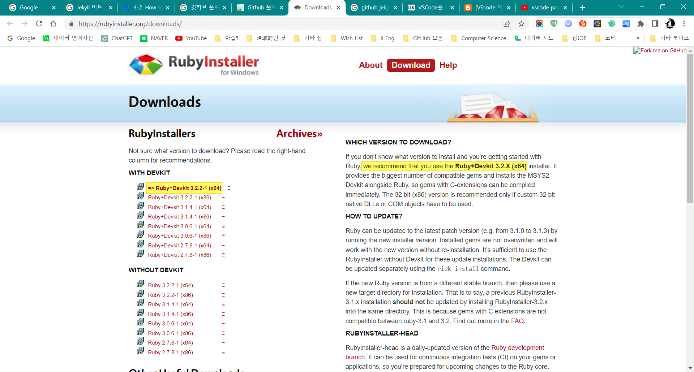
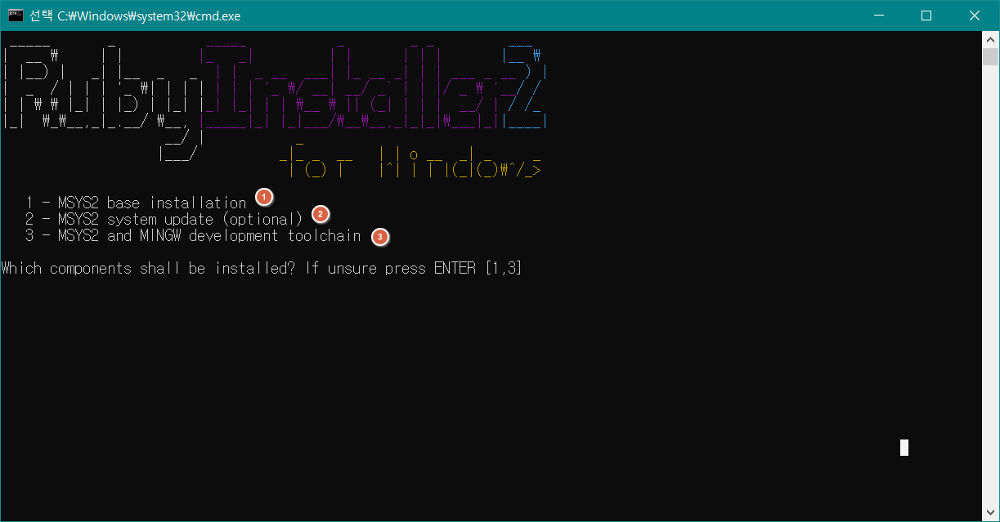
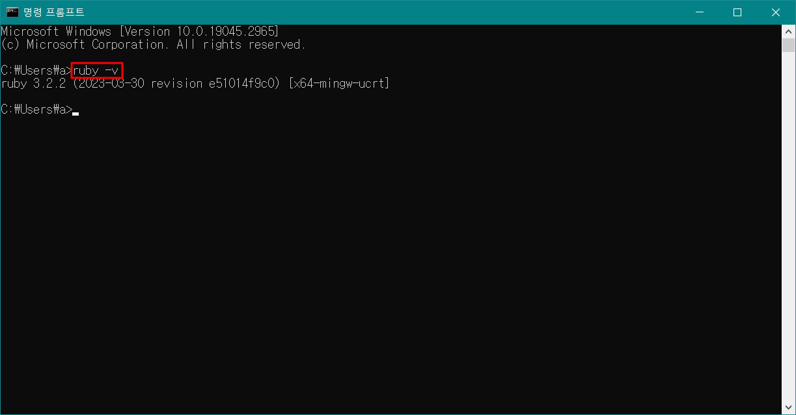
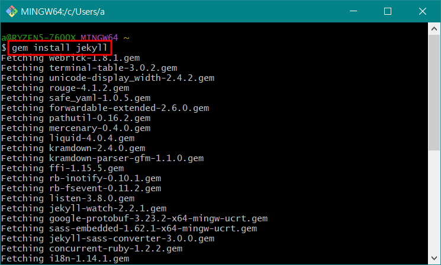
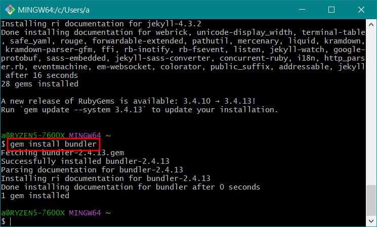
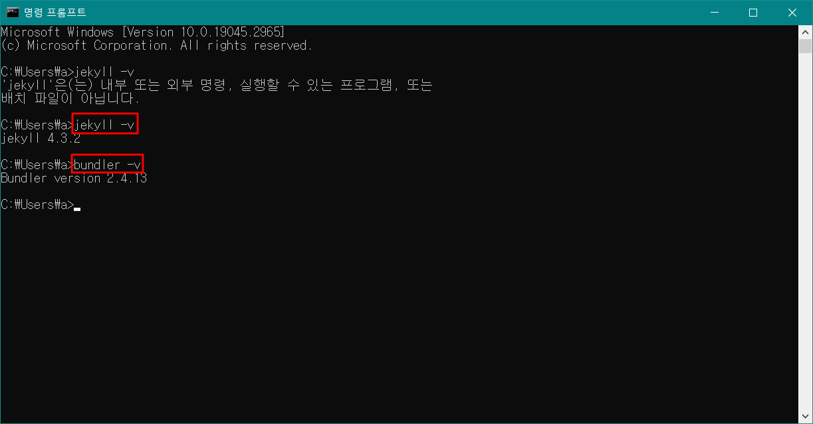
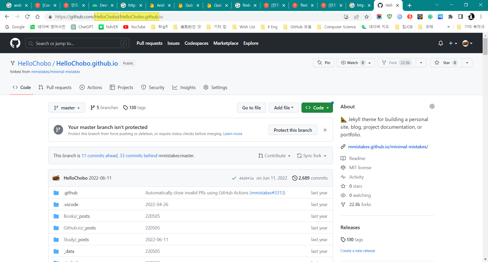

# Github.io 블로그 생성 방법

> 스크립트 언어인 **Ruby** 다운로드

> **Ruby** 설치 (1, 2, 3순)

>$ ruby -v 로 설치 확인 

> jekyll 설치

> bundler 설치

> jekyll 및 bundler 설치 확인

> 생성된 .io  

> 이후, 로컬 내 .io 폴더 내에서   
> $ bundle install  
> $ bundle update  
> $ bundle install  

> $ bundle exec jekyll serve 로 로컬 서버 실행  
> http://127.0.0.1:4000/ 에서 확인