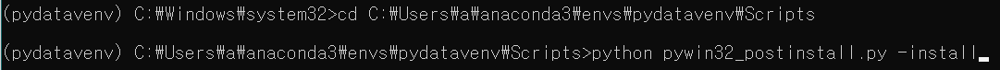
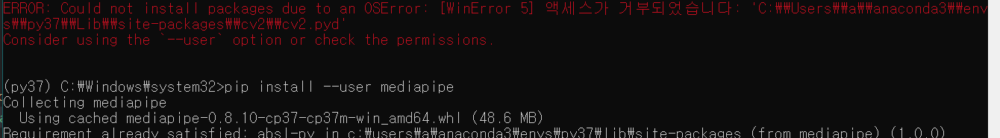
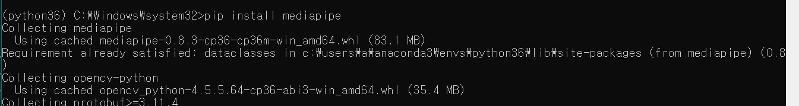

# pip install 에러

## pywinauto
<pre>
<code>
pip install pywinauto

>> ImportError: DLL load failed while importing win32api: 지정된 모듈을 찾을 수 없습니다.
</code>
</pre>

> solved  
> 1. cd ../가상환경/Scripts 에서
> 2. python pywin32_postinstall.py -install  

## mediapipe
pip install mediapipe 설치 에러
<pre>
<code>

ERROR: Could not install packages due to an OSError: [WinError 5] 액세스가 거부되었습니다: 'C:\\Users\\a\\anaconda3\\envs\\py37\\Lib\\site-packages\\cv2\\cv2.pyd'
Consider using the `--user` option or check the permissions.

</code>
</pre>

> solved  
> 1. pip install --user mediapipe
> 2. 설치는 되었다고 나오고, 다시 pip install mediapipe시 설치는 됨 -> but library에 없음  
> -
> -
> 1. python=3.6 에서 pip install mediapipe 로 설치됨  
> 2. 3.6에 설치 후 다른 module 설치하다가 numpy 호환이 떨어져서 다시 3.7에서 import 하니 된다고 뜸 -> 
> conda list에 없는데 import 됨 (?)

