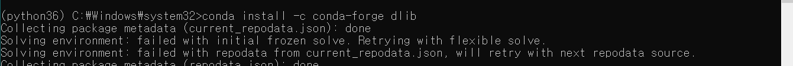

<pre>
<code>

</code>
</pre>

# 무난

## pip install type
> pip install import_ipynb

- tqdm, librosa
- fastdtw

# 복잡
import pyaudio
> pip install pipwin  
> pipwin install pyaudio  

import dlib
> 1. pip install cmake
> 2. conda install -c conda-forge dlib

# 헬
import mediapipe
> 