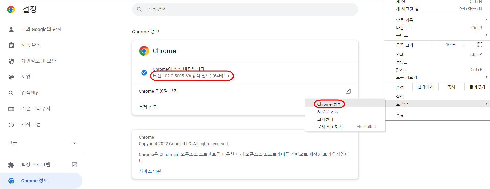
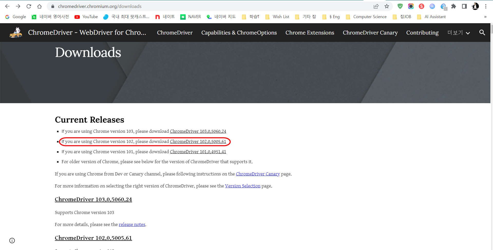
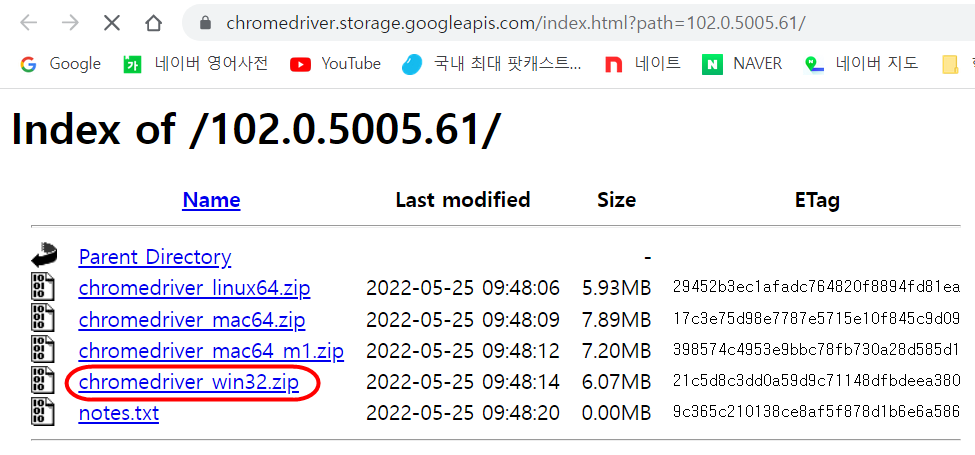
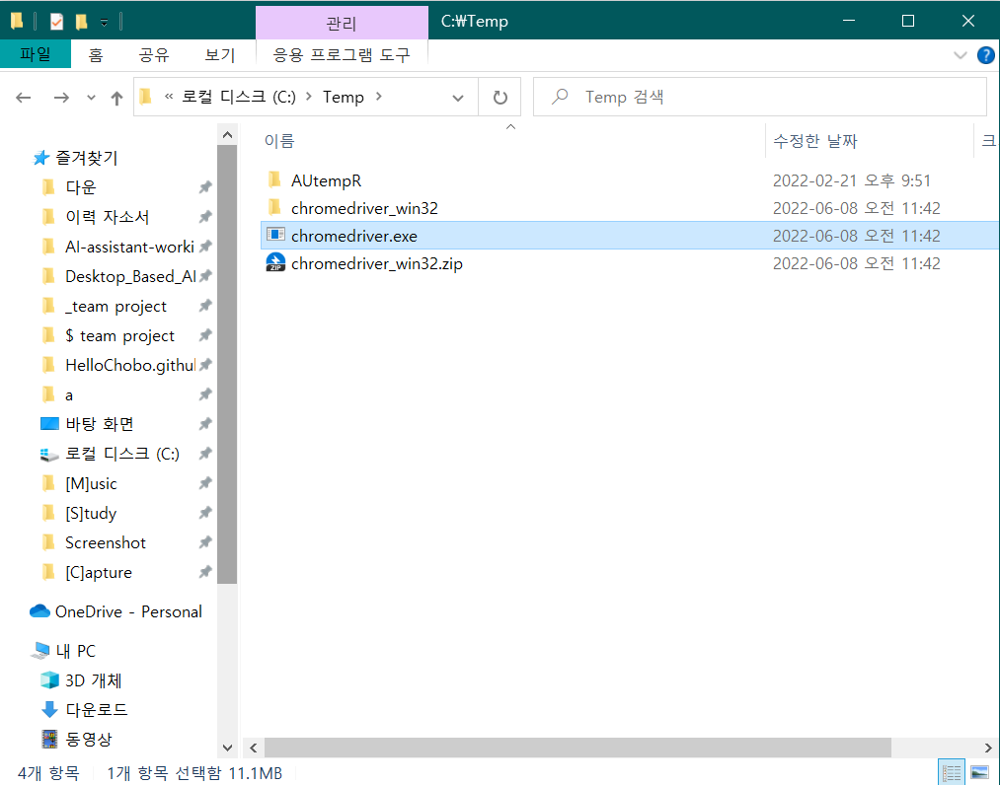
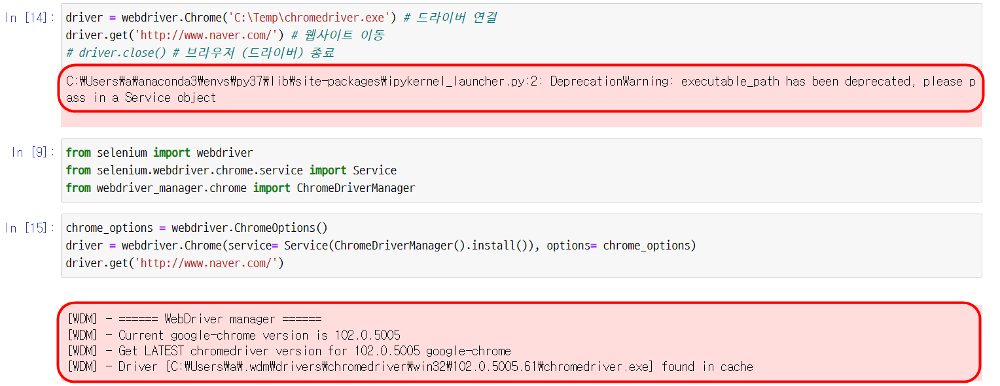

# 1. Seleninum 설치

# 2. Chromedriver 다운


현재 자신의 브라우저 버전과 동일한 파일 설택 후 다운




OS는 64비트지만 win32.zip 다운


특정 경로에 압축을 푼다 (후에 드라이버를 불러올 경로임)


# Selenium
```python
from selenium import webdriver

driver = webdriver.Chrome('C:\Temp\chromedriver.exe') # 드라이버 연결
driver.get('http://www.naver.com/') # 웹사이트 이동
# driver.close() # 브라우저 (드라이버) 종료
```

Warning message :
> DeprecationWarning: executable_path has been deprecated, please pass in a Service object

4.0이상의 셀레니움에서 3.0대 버전의 기능을 쓰려고 하니 warning  
-> pip install webdriver_manager 설치 후  
밑의 코드 이용

```python
from selenium import webdriver
from selenium.webdriver.chrome.service import Service
from webdriver_manager.chrome import ChromeDriverManager

chrome_options = webdriver.ChromeOptions()
driver = webdriver.Chrome(service= Service(ChromeDriverManager().install()), options= chrome_options)
driver.get('http://www.naver.com/')
```